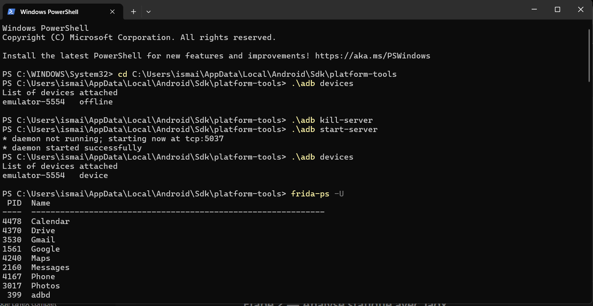
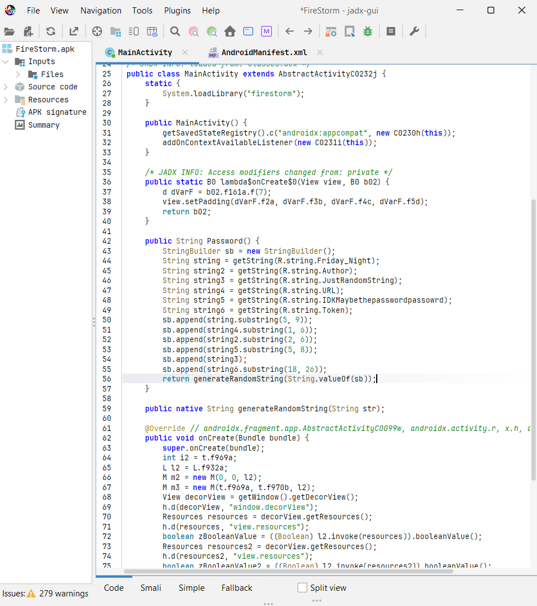
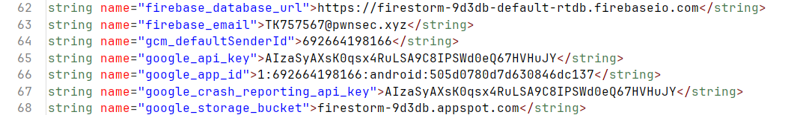
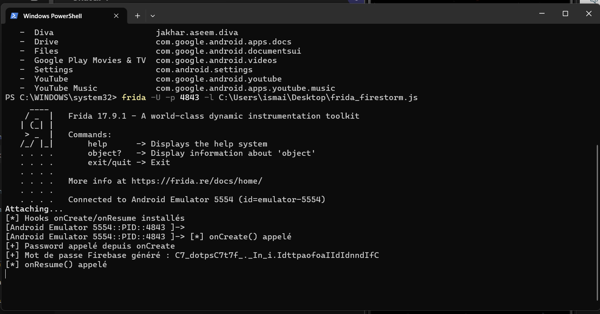
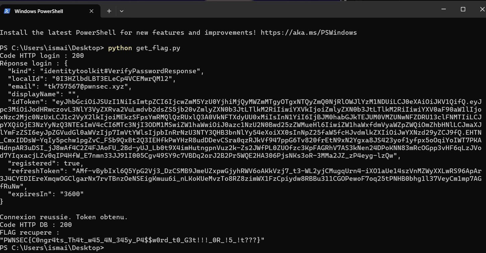

# Exploitation d'une application Android avec Frida et Firebase

## Objectif
Trouver un mot de passe caché et récupérer un flag.

## Contexte
L'application est vulnérable. Elle possède une fonction Password() qui permet de définir le mot de passe, mais celle-ci n'est jamais appelée lors de l'utilisation normale. 

## Étapes

### Étape 1 : Préparation
La communication avec le téléphone est vérifiée avec ADB. Le serveur Frida en arrière-plan est validé et prêt pour l'instrumentation.

### Étape 2 : Analyse statique
L'analyse statique du code décompilé avec Jadx montre la logique interne. On y trouve la fonction Password(), chargée de générer le mot de passe en mémoire.

### Étape 3 : Extraction de la configuration Firebase
L'examen du fichier de ressources res/values/strings.xml fournit la configuration de la base de données Firebase. Nous y récupérons l'email de connexion et les clés d'accès.

### Étape 4 : Exploitation avec Frida
Le framework Frida est utilisé pour réaliser un Hook. Cette méthode dynamique force l'exécution de la fonction Password() pour pouvoir afficher le mot de passe généré.

### Étape 5 : Exploitation Firebase
Un script Python utilise les identifiants Firebase et le fameux mot de passe. L'objectif est de s'authentifier directement sur la base de données.

## Résultat final
Le script d'exploitation réussit son authentification à distance et permet d'afficher le flag.

## Conclusion
Outils comme Frida permettent d'exécuter du code caché à la volée. La complémentarité entre la méthode statique pour la reconnaissance et l'approche dynamique s'avère très puissante.
